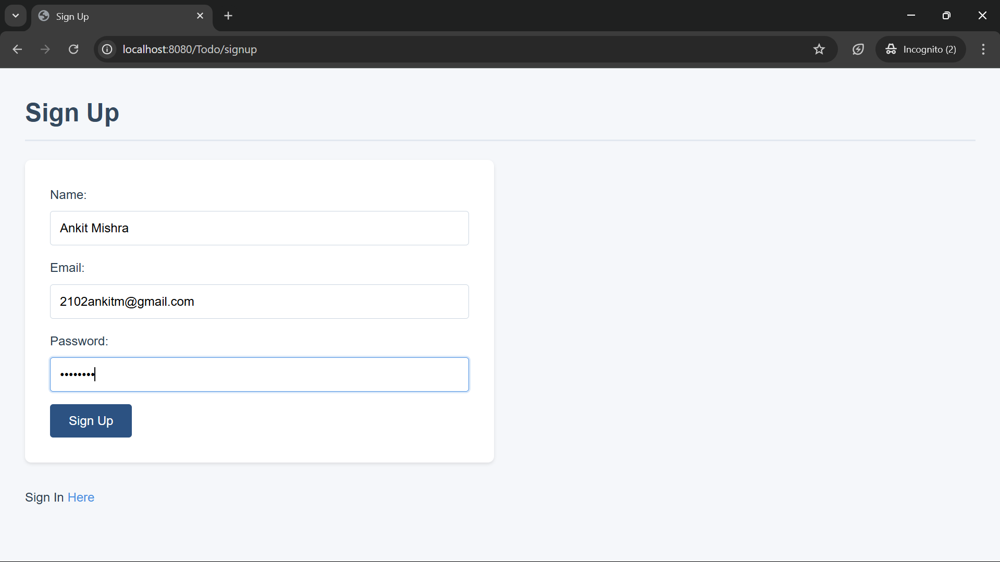
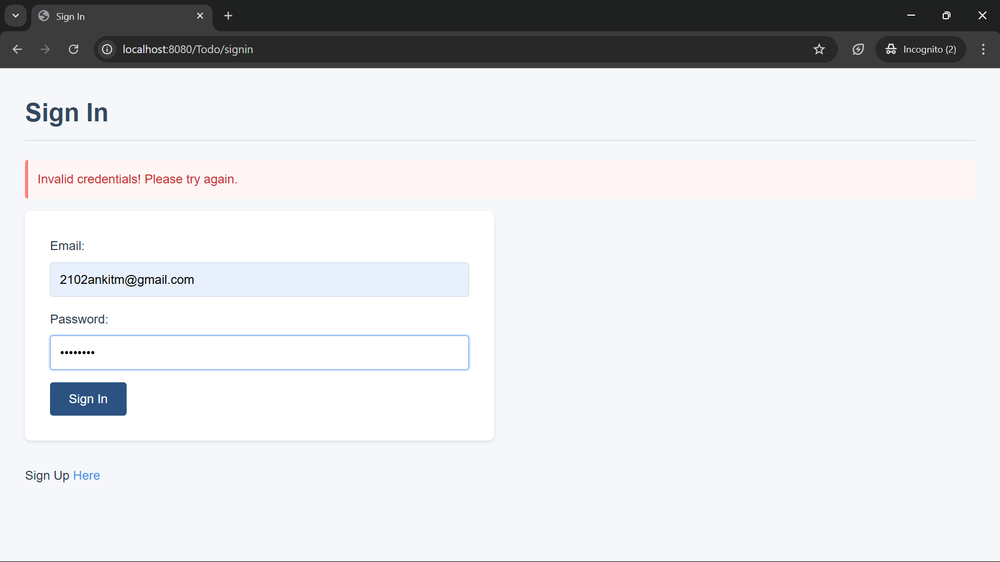
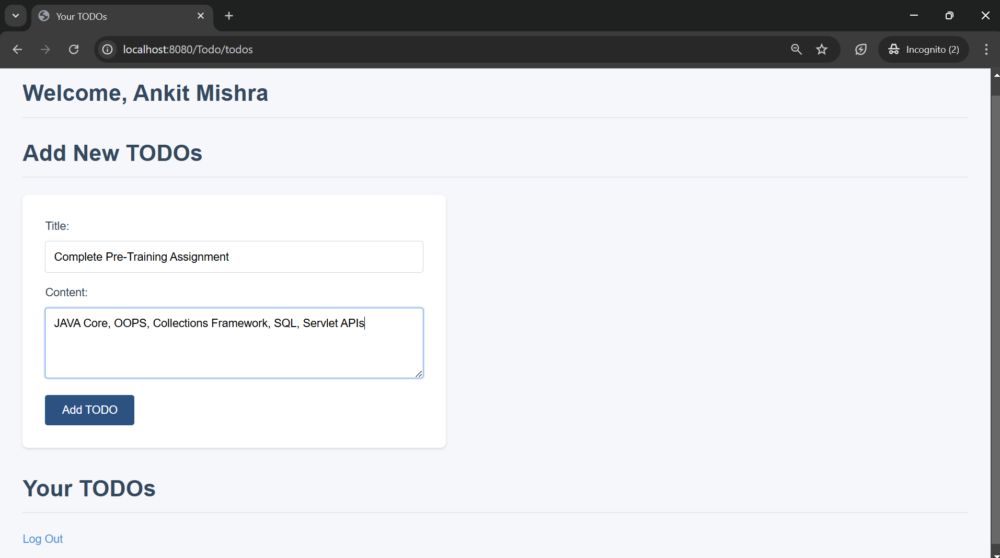
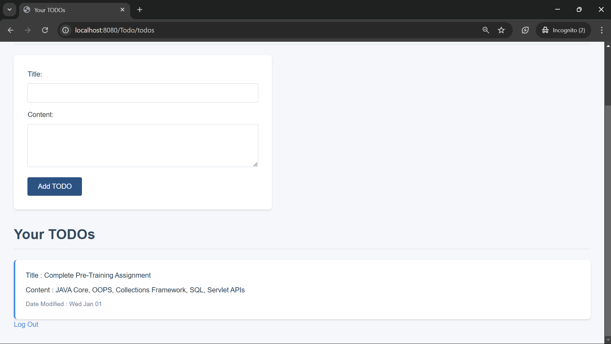

# Todo Application

A minimal web-based Todo application built with Java JSP that allows users to manage their daily tasks with user authentication and persistent storage.

## Features

### User Authentication
- **Sign Up**: New users can create an account with:
  - Name
  - Email
  - Password
- **Sign In**: Registered users can log in using:
  - Email
  - Password
- **Session Management**: Maintains user sessions for secure access
- **Logout**: Users can safely end their sessions

### Todo Management
- **Create Todos**: Users can create new todos with:
  - Title
  - Content
  - Auto-captured creation or last modified date
- **View Todos**: Display all todos for the logged-in user
  - Organized display of todo items
  - Shows title, content, and modification date
  - Responsive layout for various screen sizes

### UI Features
- Professional and clean interface
- Responsive design that works on desktop and mobile devices
- Error message display for form validation
- Navigation between different sections of the application

## Technical Stack

### Frontend
- JSP (JavaServer Pages)
- HTML5
- CSS3 (Professional corporate theme)
- JavaScript (For dynamic content rendering)

### Backend
- Java
- Servlet API
- Session Management
- Custom utility classes (Person, Todo)

# Screenshots

A collection of screenshots showcasing the features of TodoApp.

## Screenshot 1: SignUp

## Screenshot 2: Signin Error

## Screenshot 3: Add Todo

## Screenshot 4: View Todo
